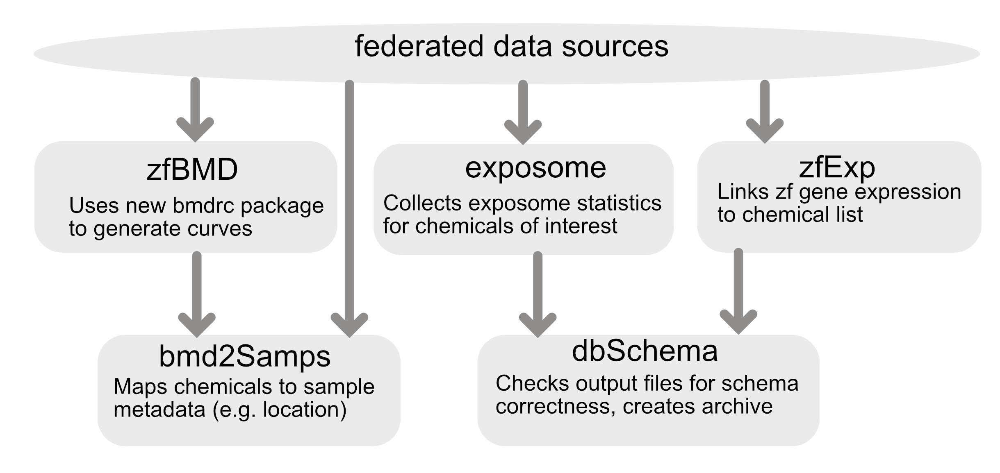

# Superfund Research Program Analytics


This repository contains the code necessary to process any new data for the Superfund Research Program Analytics Portal. Currently the portal displays two types of data:
- Zebrafish measurements describing the response to zebrafish under various levels of chemical stressors
- Environmental sample measurements that describe the relative concentration of specific chemicals in environmental samples.
- Human differential expression measurements from each sample

Furthermore we are in the process of adding two more types of data:
- Zebrafish differential expression measurements for each chemical
- Human wristband measurements of chemical concentrations.

The data can be browsed at http://srp.pnnl.gov

This repository contains the code to handle various aspects of this portal, each described below in a unified workflow.

## System architecture
The analytics pipeline was built with a module architecture stored in series of docker images to enable the pipeline to be processed in individual stages. Currently there are five modules:
1. dbSchema: This module validates files when they are input into system and when they are pushed to the database to ensure they align to expected schemas.
2. zfBmd: This module processes the zebrafsih benchmark dose data to assess the endpoints described below.
3. zfExp: This module formats gene expression data
4. bmd2Samps: This module combines existing zebrafish data with new data from the `zfBmd` module and also integratees environmental sample information
5. exposome: This module pulls exposome data and creates an outputed file

A depiction of the framework is shown below:



### To run pipeline

Here we have one script that will run the modules above. This script is still  a work in process but currently runs:
```
sh buildV1db.sh
```


### Docker image testing
Currently all changes to the repository trigger a build of the docker image and pushing it to DockerHub. If this fails you will be notified.

If you would like to build the docker image locally, you can check out this repository and run build it using the following command:

``` bash
docker build . -t sgosline/srp-analytics
```

This is required for local testing of the code.

## Benchmark Dose Calculation
Calculating the benchmark dose of each chemical on the zebrafish is an active area of research. This analysis is described in an upcoming manuscript and is primarily contained in the [qc_BMD](./qc_BMD) directory. The data format required as input to this is described in the [processing pipeline schema](./schemas/processingPipelineSchema.xlsx).

Any changes to the BMD calculation will have to pass a series of tests to ensure that they work with the existing data format.

### BMD Testing
Currently there are two tests for the BMD calculation, one for the morpohological changes and one for the light response. These are both automated in the continuous integration tests, but can be evaluated locally using the following commands:

``` bash
docker run srp-analytics --test-morpho
docker run srp-analytics --test-lpr
```

Note : These commands run with shorter version ("devel") for faster sanity check by default.


## Linking zebrafish data to environmental sample data

Once we have re-calculated BMD values, we must link these data to environmental sample data. This data is stored locally on this repostiory in the [data](./data) directory, yet is read in and harmonized with the chemical data for final consumption.

### Incoming Data
The environmental sample data has a very specific format that is defined in our [schemas](./schemas) directory. To test the building the database with new data you can simply run:

``` bash
docker run srp-analytics
```
This is currently being run upon pushing changes to the repository.

### Outgoing Data

To validate an output CSV with a schema, use the following format:
```
python3 validate.py <path to CSV file> <schema>
```
or use the Docker image to validate all files:
```
docker run srp-analytics --validate
```

Allowable schemas: chemdoseResponseVals, chemicalsByExtractSample, chemSummaryStats, chemXYcoords, envSampdoseResponseVals, envSampSummaryStats, or envSampXYcoords
Examples:

* ```python3 validate.py out/chemXYcoords.csv chemXYcoords```
* ```python3 validate.py out/chemdoseResponseVals.csv chemdoseResponseVals```
