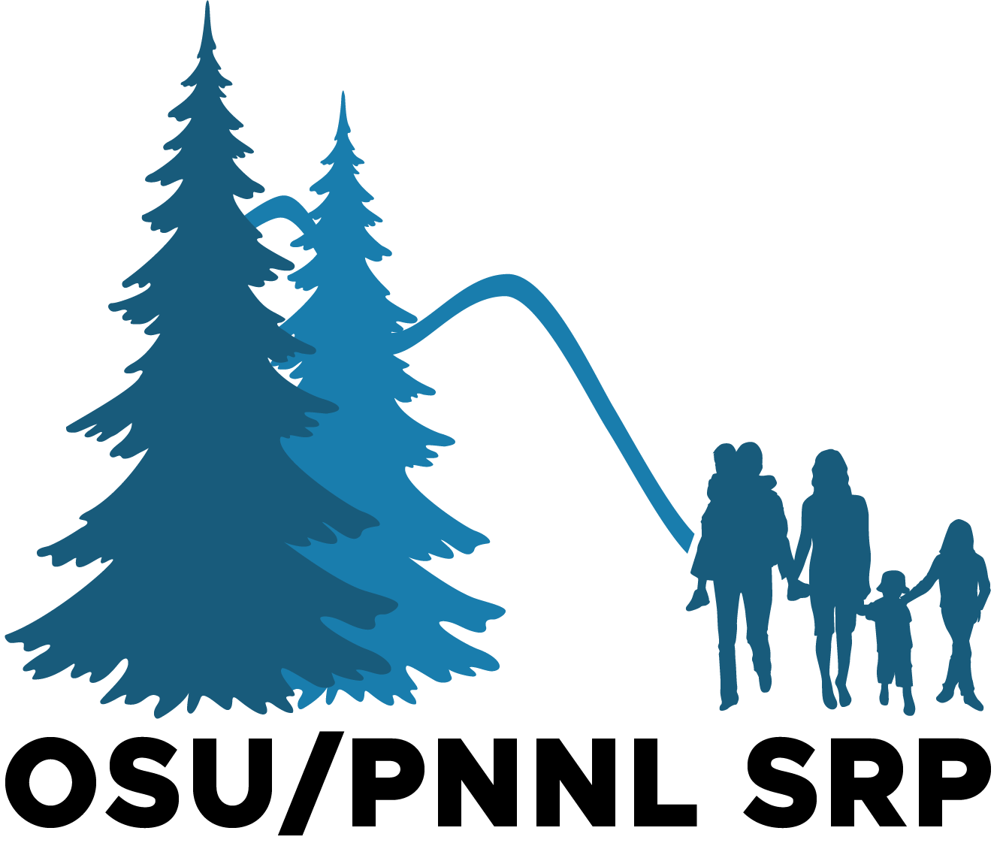

# Superfund Research Program Analytics


This repository contains the code necessary to process any new data for the Superfund Research Program Analytics Portal. Currently the portal displays two types of data:
- Zebrafish measurements describing the response to zebrafish under various levels of chemical stressors
- Environmental sample measurements that describe the relative concentration of specific chemicals in environmental samples.

Furthermore we are in the process of adding two more types of data:
- Human differential expression measurements for each chemical
- Human wristband measurements of chemical concentrations.

The data can be browsed at http://srp.pnnl.gov

This repository contains the code to handle various aspects of this portal, each described below.

## Data Summary

### Chemical Data

Below is a snapshot of the database from 2021/10/11:

|chemical_class|End Points|Samples|Chemicals
| --- | ---|--- |---|
|Flame Retardant|139|0|8|
|Fungicide|267|0|15|
|Herbicide|160|0|9|
|Industrial|284|0|16|
|Insecticide|428|0|24|
|Natural|72|0|4|
|PAH|2791|2789|155|
|Pharmacological|90|0|5|
|Unclassified|5365|0|308|

### Sample Data

Below is a snapshot of the sample database from 2021/10/11:

|LocationName|End Points|Chemicals|Number of samples|
| --- | --- | --- | --- |
|Columbia River Downstream|108|150|6|
|Columbia River Upstream|90|114|5|
|Grand Isle, Louisiana|144|167|8|
|Gulf Seal No. 253 Henry Company|54|79|3|
|Gulf Shores, Alabama|126|161|8|
|Gulfport, Mississippi|108|132|6|
|Henry Seal No. 532, Henry Company|54|42|3|
|Johnson Creek|18|46|2|
|McCormick and Baxter|108|161|6|
|None|252|308|14|
|Pensacola, Florida|72|72|7|
|Railroad Bridge|198|237|11|
|RM 1 NW|18|47|2|
|RM 11E|36|56|3|
|RM Eight West|108|151|6|
|Sauvie East|108|152|6|
|Sauvie West|144|224|8|
|St. John's Bridge|90|140|6|
|Steel Pipe|90|102|6|
|Synthetic Lab-derived|54|16|5|
|Tarconite Neyra Industries Inc.|72|93|4|
|Wyckoff Co. Eagle Harbor|108|139|6|


## Docker image
All code in this repository requires specific package components that are contained in a Docker image. The Docker image is built automatically and stored [on Docker Hub](https://hub.docker.com/repository/docker/sgosline/srp-analytics). As such it can be pulled locally using the following command:

``` bash
docker pull sgosline/srp-analytics
```

### Docker image testing
Currently all changes to the repository trigger a build of the docker image and pushing it to DockerHub. If this fails you will be notified.

If you would like to build the docker image locally, you can check out this repository and run build it using the following command:

``` bash
docker build . -t sgosline/srp-analytics
```

This is required for local testing of the code.

## Benchmark Dose Calculation
Calculating the benchmark dose of each chemical on the zebrafish is an active area of research. This analysis is described in an upcoming manuscript and is primarily contained in the [qc_BMD](./qc_BMD) directory. The data format required as input to this is described in the [processing pipeline schema](./schemas/processingPipelineSchema.xlsx).

Any changes to the BMD calculation will have to pass a series of tests to ensure that they work with the existing format data format.

### BMD Testing
Currently there are two tests for the BMD calculation, one for the morpohological changes and one for the light response. These are both automated in the continuous integration tests, but can be evaluated locally using the following commands:

``` bash
python 3 dataQcBmd.py --test-morpho
python3 dataQcBmd.py --test-lpr
```

Note: these commands currently only work for chemical dose-response values, and still need to be updated to work with extract dose-response values.

## Linking zebrafish data to environmental sample data

Once we have re-calculated BMD values, we must link these data to environmental sample data. This data is stored locally on this repostiory in the [data](./data) directory, yet is read in and harmonized with the chemical data for final consumption.

### Incoming Data
The environmental sample data has a very specific format that is defined in our [schemas](./schemas) directory. To test the building the database with new data you can simply run:

``` bash
python3 dataQcBmd.py
```
This is currently being run upon pushing changes to the repository.

### Outgoing Data

To validate an output CSV with a schema, use the following format:
```
python3 validate.py <path to CSV file> <schema>
```

Allowable schemas: chemdoseResponseVals, chemicalsByExtractSample, chemSummaryStats, chemXYcoords, envSampdoseResponseVals, envSampSummaryStats, or envSampXYcoords
Examples:

* ```python3 validate.py out/chemXYcoords.csv chemXYcoords```
* ```python3 validate.py out/chemdoseResponseVals.csv chemdoseResponseVals```
