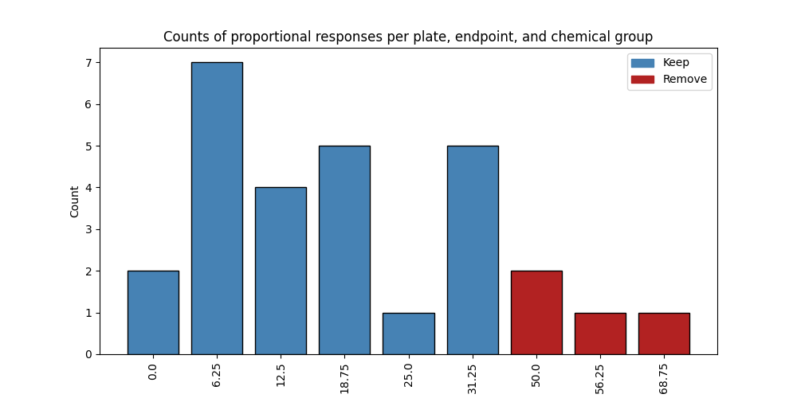
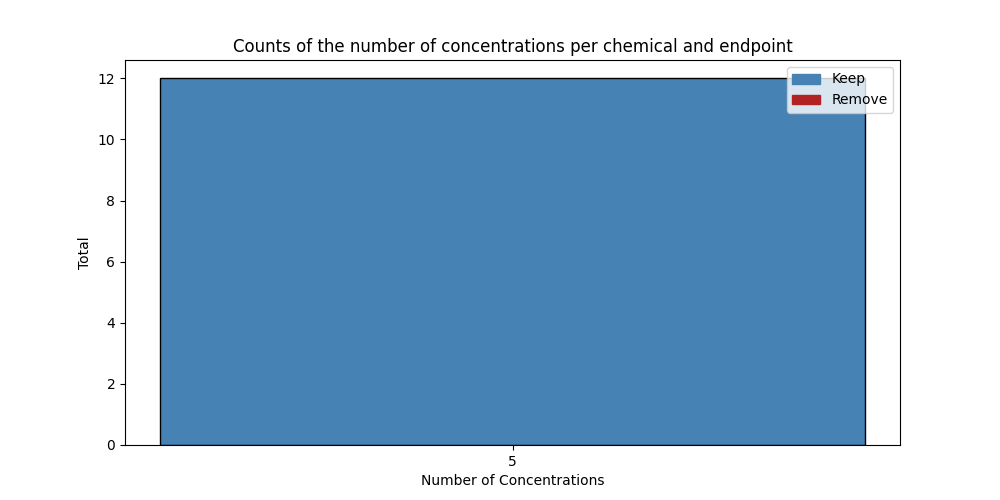
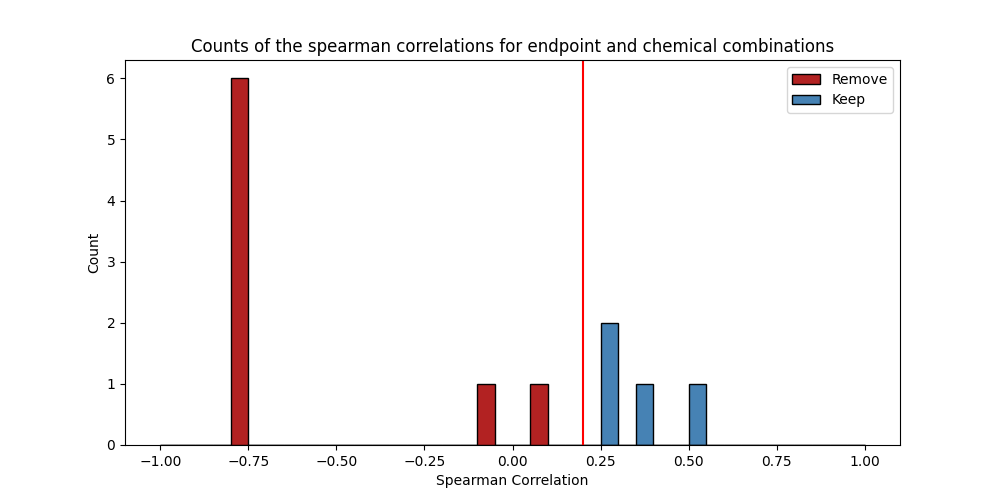

# Benchmark Dose Curves

## Input Data

A **lpr class** object was created. The following column names were set:

|Parameter|Column Name|
|---------|-----------|
|Chemical|sample_id|
|Plate|plate_id|
|Well|well|
|Concentration|concentration|
|Time|time|
|Value|value|
|Cycle Length|20.0|
|Cycle Cooldown|10.0|
|Starting Cycle|light|

## Pre-Processing

#### **Combine & Make New Endpoints**
This step was not conducted.

#### **Set Invalid Wells to NA**

This step was not conducted.

#### **Remove Invalid Endpoints**

This step was not conducted.

## Filtering

#### **Negative Control Filter**

Plates with unusually high responses in negative control samples were filtered. The response threshold was set to **50**. See a summary below:

|Response|Number of Plates|Filter|
|---|---|---|
|0.0|2|Keep|
|6.25|7|Keep|
|12.5|4|Keep|
|18.75|5|Keep|
|25.0|1|Keep|
|31.25|5|Keep|
|50.0|2|Remove|
|56.25|1|Remove|
|68.75|1|Remove|

And here is the plot:

#### **Minimum Concentration Filter**

Endpoints with too few concentration measurements (non-NA) to model are removed. The minimum was set to **3**. See a summary below:

|Number of Concentrations|Number of Endpoints|Filter|
|---|---|---|
|5|12|Keep|

And here is the plot:

#### **Correlation Score Filter**

Endpoints with little to no positive correlation with dose are unexpected and should be removed. The correlation threshold was set to **0.2**. See a summary below:

|Correlation Score Bin|Number of Endpoints|
|---|---|
|-1.0|0.0|
|-0.8|6.0|
|-0.6|0.0|
|-0.4|0.0|
|-0.2|1.0|
|0.0|1.0|
|0.2|3.0|
|0.4|1.0|
|0.6|0.0|
|0.8|0.0|

And here is the plot:

## Model Fitting & Output Modules

#### **Filter Summary**

Overall, 4 endpoint and chemical combinations were considered. 1 were deemed eligible for modeling, and 3 were not based on filtering selections explained in the previous section. Of the 1 deemed eligible for modeling, 0 did not pass modeling checks.

#### **Model Fitting Selections**

The following model fitting parameters were selected.

|Parameter|Value|Parameter Description|
|---|---|---|
|Goodness of Fit Threshold|0.1|Minimum p-value for fitting a model. Default is 0.1|
|Akaike Information Criterion (AIC) Threshold|2|Any models with an AIC within this value are considered an equitable fit. Default is 2.
|Model Selection|lowest BMDL|Either return one model with the lowest BMDL, or combine equivalent fits|

#### **Model Quality Summary**

Below is a summary table of the number of endpoints with a high quality fit and those with poor fit, as defined by each label below.

| Modeled Flag                    |   Count |
|:--------------------------------|--------:|
| Fail - correlation score filter |       3 |
| Pass                            |       1 |

And here is a summary delineating the good and moderate fits,based off of the following properties.

| Flag | Number of Non-Control Concentrations | Spearman Correlation | Goodness of Fit | BMD50 | Model Convergence |
| -- | -- | -- | -- | -- | -- |
| Not Fit | < 3 | < 0.2 | < 0.1 | Not within concentration range | No Models Converged |
| Moderate | >= 3 | 0.2 - 0.7 | >= 0.1 | Not within concentration range | At least 1 model converged |
| Good | >= 5 | > 0.7 | >= 0.1 | Within concentration range | At least 1 model converged |

| DataQC Flag   |   Count |
|:--------------|--------:|
| Not Fit       |       3 |
| Moderate      |       1 |

#### **Output Modules**

Below, see a table of useful methods for extracting outputs from bmdrc.

|Method|Description|
|---|---|
|.bmds|Table of fitted benchmark dose values|
|.bmds_filtered|Table of filtered models not eligible for benchmark dose calculations|
|.output_res_benchmark_dose|Table of benchmark doses for all models, regardless of whether they were filtered or not|
|.p_value_df|Table of goodness of fit p-values for every eligible endpoint|
|.aic_df|Table of Akaike Information Criterion values for every eligible endpoint|
|.response_curve|Plot a benchmark dose curve for an endpoint|

