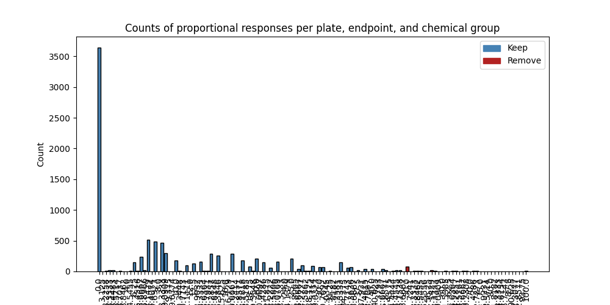
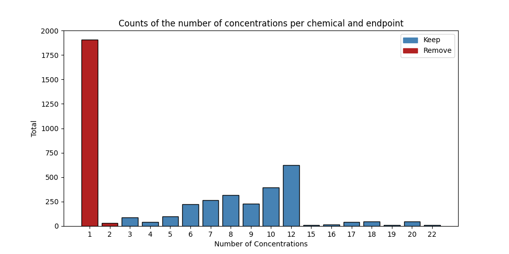
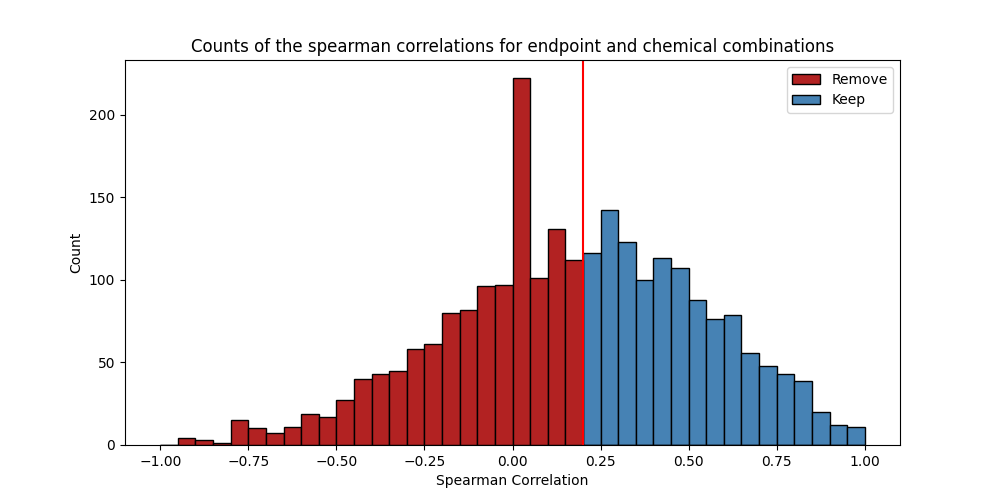

# Benchmark Dose Curves

## Input Data

A **lpr class** object was created. The following column names were set:

|Parameter|Column Name|
|---------|-----------|
|Chemical|chemical_id|
|Plate|plate_id|
|Well|well|
|Concentration|concentration|
|Time|time|
|Value|value|
|Cycle Length|20.0|
|Cycle Cooldown|10.0|
|Starting Cycle|light|

## Pre-Processing

#### **Combine & Make New Endpoints**
This step was not conducted.

#### **Set Invalid Wells to NA**

This step was not conducted.

#### **Remove Invalid Endpoints**

This step was not conducted.

## Filtering

#### **Negative Control Filter**

Plates with unusually high responses in negative control samples were filtered. The response threshold was set to **50**. See a summary below:

|Response|Number of Plates|Filter|
|---|---|---|
|0.0|3639|Keep|
|3.125|4|Keep|
|3.2258|9|Keep|
|3.3333|24|Keep|
|3.4483|21|Keep|
|3.5714|1|Keep|
|3.7037|9|Keep|
|3.8462|4|Keep|
|4.0|4|Keep|
|4.5455|8|Keep|
|6.25|148|Keep|
|6.4516|6|Keep|
|6.6667|234|Keep|
|6.8966|24|Keep|
|7.1429|517|Keep|
|7.4074|3|Keep|
|7.6923|490|Keep|
|8.0|3|Keep|
|8.3333|463|Keep|
|9.0909|295|Keep|
|9.375|3|Keep|
|9.6774|2|Keep|
|10.0|175|Keep|
|10.3448|10|Keep|
|10.7143|1|Keep|
|11.1111|95|Keep|
|12.0|2|Keep|
|12.5|130|Keep|
|12.9032|1|Keep|
|13.3333|154|Keep|
|13.6364|6|Keep|
|13.7931|11|Keep|
|14.2857|285|Keep|
|14.8148|1|Keep|
|15.3846|261|Keep|
|15.625|1|Keep|
|16.0|1|Keep|
|16.129|3|Keep|
|16.6667|289|Keep|
|17.2414|3|Keep|
|17.8571|1|Keep|
|18.1818|175|Keep|
|18.5185|1|Keep|
|18.75|80|Keep|
|19.3548|5|Keep|
|20.0|207|Keep|
|20.6897|3|Keep|
|21.4286|153|Keep|
|21.875|3|Keep|
|22.2222|61|Keep|
|22.5806|2|Keep|
|23.0769|155|Keep|
|23.3333|2|Keep|
|24.0|1|Keep|
|24.1379|4|Keep|
|25.0|204|Keep|
|25.8065|4|Keep|
|26.6667|42|Keep|
|27.2727|101|Keep|
|27.5862|6|Keep|
|28.125|7|Keep|
|28.5714|90|Keep|
|29.0323|3|Keep|
|30.0|71|Keep|
|30.7692|69|Keep|
|31.0345|2|Keep|
|31.25|12|Keep|
|31.8182|2|Keep|
|32.2581|3|Keep|
|33.3333|152|Keep|
|34.375|2|Keep|
|35.7143|61|Keep|
|36.3636|67|Keep|
|36.6667|1|Keep|
|37.5|15|Keep|
|37.931|1|Keep|
|38.4615|39|Keep|
|38.7097|2|Keep|
|40.0|38|Keep|
|40.625|3|Keep|
|41.3793|2|Keep|
|41.6667|35|Keep|
|42.8571|22|Keep|
|43.75|3|Keep|
|44.4444|7|Keep|
|45.4545|21|Keep|
|46.1538|21|Keep|
|46.6667|2|Keep|
|50.0|76|Remove|
|51.7241|1|Remove|
|53.3333|5|Remove|
|53.8462|14|Remove|
|54.5455|11|Remove|
|55.5556|3|Remove|
|56.25|3|Remove|
|57.1429|18|Remove|
|58.3333|11|Remove|
|59.0909|1|Remove|
|60.0|4|Remove|
|61.5385|11|Remove|
|62.5|3|Remove|
|63.6364|5|Remove|
|64.2857|11|Remove|
|64.5161|1|Remove|
|66.6667|11|Remove|
|69.2308|6|Remove|
|70.0|3|Remove|
|71.4286|7|Remove|
|72.7273|5|Remove|
|75.0|2|Remove|
|76.9231|3|Remove|
|78.5714|3|Remove|
|80.0|2|Remove|
|81.8182|2|Remove|
|83.3333|1|Remove|
|84.6154|2|Remove|
|85.7143|1|Remove|
|87.5|1|Remove|
|90.625|1|Remove|
|92.3077|1|Remove|
|92.8571|1|Remove|
|93.75|1|Remove|
|100.0|10|Remove|

And here is the plot:

#### **Minimum Concentration Filter**

Endpoints with too few concentration measurements (non-NA) to model are removed. The minimum was set to **3**. See a summary below:

|Number of Concentrations|Number of Endpoints|Filter|
|---|---|---|
|22|8|Keep|
|20|47|Keep|
|19|8|Keep|
|18|48|Keep|
|17|40|Keep|
|16|15|Keep|
|15|8|Keep|
|12|622|Keep|
|10|396|Keep|
|9|228|Keep|
|8|319|Keep|
|7|267|Keep|
|6|222|Keep|
|5|97|Keep|
|4|42|Keep|
|3|88|Keep|
|2|33|Remove|
|1|1905|Remove|

And here is the plot:

#### **Correlation Score Filter**

Endpoints with little to no positive correlation with dose are unexpected and should be removed. The correlation threshold was set to **0.2**. See a summary below:

|Correlation Score Bin|Number of Endpoints|
|---|---|
|-1.0|8.0|
|-0.8|43.0|
|-0.6|103.0|
|-0.4|207.0|
|-0.2|355.0|
|0.0|566.0|
|0.2|481.0|
|0.4|384.0|
|0.6|226.0|
|0.8|82.0|

And here is the plot:

## Model Fitting & Output Modules

#### **Filter Summary**

Overall, 1112 endpoint and chemical combinations were considered. 283 were deemed eligible for modeling, and 829 were not based on filtering selections explained in the previous section. Of the 283 deemed eligible for modeling, 38 did not pass modeling checks.

#### **Model Fitting Selections**

The following model fitting parameters were selected.

|Parameter|Value|Parameter Description|
|---|---|---|
|Goodness of Fit Threshold|0.1|Minimum p-value for fitting a model. Default is 0.1|
|Akaike Information Criterion (AIC) Threshold|2|Any models with an AIC within this value are considered an equitable fit. Default is 2.
|Model Selection|lowest BMDL|Either return one model with the lowest BMDL, or combine equivalent fits|

#### **Model Quality Summary**

Below is a summary table of the number of endpoints with a high quality fit and those with poor fit, as defined by each label below.

| Modeled Flag                    |   Count |
|:--------------------------------|--------:|
| Fail - other filter             |     495 |
| Fail - correlation score filter |     334 |
| Pass                            |     245 |
| Fail - GOF check                |      38 |

And here is a summary delineating the good and moderate fits,based off of the following properties.

| Flag | Number of Non-Control Concentrations | Spearman Correlation | Goodness of Fit | BMD50 | Model Convergence |
| -- | -- | -- | -- | -- | -- |
| Not Fit | < 3 | < 0.2 | < 0.1 | Not within concentration range | No Models Converged |
| Moderate | >= 3 | 0.2 - 0.7 | >= 0.1 | Not within concentration range | At least 1 model converged |
| Good | >= 5 | > 0.7 | >= 0.1 | Within concentration range | At least 1 model converged |

| DataQC Flag   |   Count |
|:--------------|--------:|
| Not Fit       |     867 |
| Moderate      |     229 |
| Good          |      16 |

#### **Output Modules**

Below, see a table of useful methods for extracting outputs from bmdrc.

|Method|Description|
|---|---|
|.bmds|Table of fitted benchmark dose values|
|.bmds_filtered|Table of filtered models not eligible for benchmark dose calculations|
|.output_res_benchmark_dose|Table of benchmark doses for all models, regardless of whether they were filtered or not|
|.p_value_df|Table of goodness of fit p-values for every eligible endpoint|
|.aic_df|Table of Akaike Information Criterion values for every eligible endpoint|
|.response_curve|Plot a benchmark dose curve for an endpoint|

